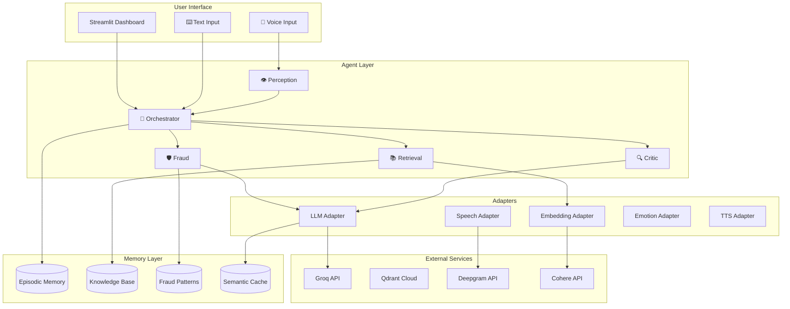

# 🛡️ Sahayak - The Vernacular Financial Sentinel

<div align="center">


**A Multi-Agent System for Financial Inclusion and Fraud Protection**

*Built for the Convolve Hackathon (Pan-IIT AI/ML Hackathon)*

[Getting Started](#-quick-start) • [Features](#-features) • [Architecture](#-architecture) • [API Reference](#-adapters-api-integrations)

</div>

---

## 📖 Overview

**Sahayak** (सहायक = Helper) is an intelligent, vernacular-first financial assistant designed to bridge the digital divide for rural and semi-urban users in India. It acts as a protective layer against financial fraud while simplifying complex banking tasks through natural language interaction.

### 🎯 Key Capabilities

| Capability | Description |
|------------|-------------|
| 🛡️ **Fraud Detection** | Real-time analysis of transaction patterns and communication for scams |
| 🗣️ **Vernacular Support** | Hindi/English voice and text interaction with automatic language detection |
| 📚 **Financial Literacy** | Explains complex schemes (PMJDY, RBI guidelines) in simple terms |
| 🎭 **Emotion Detection** | Voice sentiment analysis to detect stress/fear in fraud victims |
| 🧠 **Episodic Memory** | Remembers past conversations for contextual responses |
| ✅ **Source Attribution** | Every answer cites official documents (anti-hallucination) |

---

## ✨ Features

### 🤖 Multi-Agent System

```
┌─────────────────────────────────────────────────────────────────┐
│                      USER INPUT (Voice/Text)                     │
└─────────────────────────────────────────────────────────────────┘
                                │
                                ▼
┌─────────────────────────────────────────────────────────────────┐
│   👁️ PERCEPTION AGENT                                           │
│   • Audio → Text (Deepgram/Whisper)                              │
│   • Voice Emotion Detection (Wav2Vec2)                           │
│   • Image OCR (EasyOCR)                                          │
│   • Language Detection (Hindi/English)                           │
└─────────────────────────────────────────────────────────────────┘
                                │
                                ▼
┌─────────────────────────────────────────────────────────────────┐
│   🧠 ORCHESTRATOR AGENT                                          │
│   • Plans task execution                                         │
│   • Coordinates other agents                                     │
│   • Aggregates responses                                         │
└─────────────────────────────────────────────────────────────────┘
                    │                       │
          ┌─────────┴───────┐       ┌───────┴─────────┐
          ▼                 ▼       ▼                 ▼
┌─────────────────┐ ┌─────────────────┐ ┌─────────────────┐
│ 🛡️ FRAUD AGENT  │ │ 📚 RETRIEVAL    │ │ 🔍 CRITIC AGENT │
│                 │ │    AGENT        │ │                 │
│ • Pattern Match │ │ • Vector Search │ │ • Verify Facts  │
│ • OTP/UPI Scams │ │ • RAG Pipeline  │ │ • Check Sources │
│ • Urgency Check │ │ • Knowledge DB  │ │ • Ensure Safety │
└─────────────────┘ └─────────────────┘ └─────────────────┘
```

### 🎤 Voice Features

| Feature | Technology | Status |
|---------|------------|--------|
| Speech-to-Text | Deepgram (primary), Whisper (fallback) | ✅ Active |
| Text-to-Speech | gTTS (Hindi/English) | ✅ Active |
| Voice Emotion | Wav2Vec2 (HuggingFace) | ✅ Active |
| Language Detection | Auto (Hindi/English/Mixed) | ✅ Active |

**Supported Emotions:** `neutral`, `happy`, `angry`, `sad` (expandable to 7-8 emotions)

### 📊 Dashboard UI

- **💬 Chat Interface** - Voice & text input with TTS responses
- **📚 Knowledge Hub** - Upload/ingest PDFs, TXT documents
- **🔍 Agent Pipeline** - Visualize agent execution traces
- **📈 Memory Stats** - View episodic memory and knowledge base counts

---

## 🚀 Quick Start

### Prerequisites

- **Python 3.11+**
- **Git**
- Internet connection for API services

### 1. Clone & Setup

```bash
git clone https://github.com/MagnumSolis/Ouroboros.git
cd Ouroboros/sahayak

# Create virtual environment
python -m venv venv
source venv/bin/activate  # Windows: venv\Scripts\activate

# Install dependencies
pip install -r requirements.txt
```

### 2. Configure Environment

```bash
cp .env.example .env
# Edit .env with your API keys
```

### 3. Run Dashboard

```bash
streamlit run dashboard.py
```

Open http://localhost:8501 in your browser.

---

## 🔧 Configuration

### Required API Keys

| Service | Variable | Free Tier | Purpose |
|---------|----------|-----------|---------|
| **Groq** | `GROQ_API_KEY` | 14,400 req/day | Primary LLM (Llama 3.3 70B) |
| **Perplexity** | `PERPLEXITY_API_KEY` | Limited | Online search & verification |
| **Qdrant Cloud** | `QDRANT_URL`, `QDRANT_API_KEY` | 1GB free | Vector database |

### Optional API Keys

| Service | Variable | Purpose |
|---------|----------|---------|
| **Cohere** | `COHERE_API_KEY` | Production embeddings (1024-dim) |
| **Deepgram** | `DEEPGRAM_API_KEY` | Real-time speech-to-text |
| **OpenRouter** | `OPENROUTER_API_KEY` | Backup LLM provider |
| **Gemini** | `GEMINI_API_KEY` | Backup LLM provider |
| **HuggingFace** | `HF_TOKEN` | Faster model downloads |

### Example `.env`

```bash
# LLM Providers
GROQ_API_KEY=gsk_xxx
PERPLEXITY_API_KEY=pplx-xxx

# Vector Database (Qdrant Cloud)
QDRANT_URL=https://xxx.cloud.qdrant.io
QDRANT_API_KEY=xxx

# Embeddings
COHERE_API_KEY=xxx

# Speech
DEEPGRAM_API_KEY=xxx

# HuggingFace (for emotion models)
HF_TOKEN=hf_xxx
```

---

## 🏗️ Architecture

### System Overview



### Memory Collections (Qdrant)

| Collection | Purpose | Dimension |
|------------|---------|-----------|
| `episodic_memory` | Conversation history & agent traces | 1024 |
| `knowledge_base` | Ingested documents (PMJDY, RBI) | 1024 |
| `fraud_patterns` | Known scam patterns & indicators | 1024 |
| `working_memory` | Active session context | 1024 |
| `semantic_cache` | LLM response caching | 1024 |

---

## 📁 Project Structure

```
sahayak/
├── 📄 dashboard.py              # Main Streamlit application
├── 📄 requirements.txt          # Python dependencies
├── 📄 .env.example              # Environment template
│
├── 📂 src/                      # Source code
│   ├── 📂 adapters/             # External service integrations
│   │   ├── llm.py               # LLM providers (Groq, Perplexity, etc.)
│   │   ├── embeddings.py        # Embedding providers (Cohere, local)
│   │   ├── speech.py            # Speech-to-Text (Deepgram, Whisper)
│   │   ├── emotion.py           # Voice emotion detection (Wav2Vec2)
│   │   ├── tts.py               # Text-to-Speech (gTTS)
│   │   ├── vision.py            # OCR (EasyOCR)
│   │   └── audio_processor.py   # Unified audio pipeline
│   │
│   ├── 📂 agents/               # Multi-agent system
│   │   ├── base.py              # Base agent class
│   │   ├── orchestrator.py      # Central coordinator
│   │   ├── perception.py        # Multimodal input processing
│   │   ├── retrieval.py         # RAG & knowledge retrieval
│   │   ├── fraud.py             # Fraud detection
│   │   └── critic.py            # Response verification
│   │
│   ├── 📂 memory/               # Memory management
│   │   ├── manager.py           # Qdrant interface
│   │   ├── collections.py       # Collection definitions
│   │   ├── agent_log.py         # Agent execution logging
│   │   └── cache.py             # Semantic caching
│   │
│   └── 📂 ui/                   # UI components
│       ├── knowledge_hub.py     # Document upload interface
│       └── pipeline_viewer.py   # Agent trace visualization
│
├── 📂 scripts/                  # Utility scripts
│   ├── reset_for_demo.py        # Clear data for demo
│   ├── ingest_knowledge.py      # Seed knowledge base
│   ├── switch_emotion_model.py  # Toggle emotion models
│   ├── demo_agent_pipeline.py   # CLI pipeline demo
│   ├── demo_voice_emotion.py    # Test voice emotion
│   ├── check_episodic_memory.py # Inspect memory
│   └── test_*.py                # Various test scripts
│
└── 📂 data/                     # Data storage
    ├── 📂 uploads/              # User uploaded files
    ├── 📂 knowledge_base/       # Seed documents
    └── 📂 test_docs/            # Sample test documents
```

---

## 🔌 Adapters (API Integrations)

### LLM Adapter (`src/adapters/llm.py`)

Supports multiple providers with automatic fallback:

| Provider | Model | Use Case |
|----------|-------|----------|
| **Groq** | llama-3.3-70b-versatile | Primary (fastest) |
| **Perplexity** | sonar | Online search |
| **OpenRouter** | gemma-3-12b-it:free | Backup (free) |
| **Gemini** | gemini-2.0-flash | Backup |

### Embedding Adapter (`src/adapters/embeddings.py`)

| Provider | Dimension | Quality |
|----------|-----------|---------|
| **Cohere** | 1024 | Best for multilingual |
| **Sentence Transformers** | 384 | Local fallback |

### Speech Adapter (`src/adapters/speech.py`)

| Provider | Languages | Features |
|----------|-----------|----------|
| **Deepgram** | Hindi, English | Real-time, smart formatting |
| **Whisper** | Multi | Local fallback |

### Emotion Adapter (`src/adapters/emotion.py`)

Pre-trained Wav2Vec2 models for voice emotion:

| Model | Emotions | Size |
|-------|----------|------|
| `superb/wav2vec2-base-superb-er` | 4 | 378MB ⭐ Default |
| `ehcalabres/wav2vec2-lg-xlsr-en` | 7 | 1.27GB |

Switch models: `python scripts/switch_emotion_model.py`

---

## 📜 Scripts Reference

| Script | Purpose | Usage |
|--------|---------|-------|
| `reset_for_demo.py` | Clear uploads & Qdrant collections | `python scripts/reset_for_demo.py` |
| `ingest_knowledge.py` | Seed knowledge base with documents | `python scripts/ingest_knowledge.py` |
| `switch_emotion_model.py` | Toggle between emotion models | `python scripts/switch_emotion_model.py` |
| `demo_agent_pipeline.py` | CLI demo of agent pipeline | `python scripts/demo_agent_pipeline.py` |
| `demo_voice_emotion.py` | Test voice emotion detection | `python scripts/demo_voice_emotion.py audio.wav` |
| `check_episodic_memory.py` | Inspect episodic memory entries | `python scripts/check_episodic_memory.py` |
| `setup_qdrant.py` | Initialize Qdrant collections | `python scripts/setup_qdrant.py` |
| `test_adapters.py` | Verify API connections | `python scripts/test_adapters.py` |

---

## 🎮 Demo Guide

### 1. Fraud Detection Demo

```
User: "Someone called saying my account is blocked and asked for OTP"
```

**Expected Response:**
- 🚨 Fraud alert with severity score
- Explanation of the scam pattern
- Official RBI guidelines quoted
- Action recommendations

### 2. Knowledge Retrieval Demo

```
User: "What is PMJDY and am I eligible?"
```

**Expected Response:**
- Accurate information from ingested documents
- Source citations
- Eligibility criteria explained

### 3. Voice Emotion Demo

1. Record audio expressing stress/fear
2. System detects emotion (angry/fear/sad)
3. Response prioritized based on sentiment
4. Agent pipeline shows detected emotion

---

## 🔧 Troubleshooting

| Issue | Solution |
|-------|----------|
| `Collection doesn't exist` | Run `python scripts/setup_qdrant.py` |
| `python-dotenv parsing error` | Check `.env` for syntax errors (no spaces around `=`) |
| Slow model download | Add `HF_TOKEN` to `.env` |
| Voice emotion not working | Run `pip install transformers torch torchaudio` |
| Dashboard not loading | Check terminal for errors, verify API keys |

---

## 🤝 Contributing

1. Fork the repository
2. Create a feature branch (`git checkout -b feature/amazing`)
3. Commit changes (`git commit -m 'Add amazing feature'`)
4. Push to branch (`git push origin feature/amazing`)
5. Open a Pull Request

---

## 📝 License

This project is licensed under the MIT License.

---

<div align="center">

**Built with ❤️ for Financial Inclusion**

*Sahayak - Your Trusted Financial Guardian*

</div>
