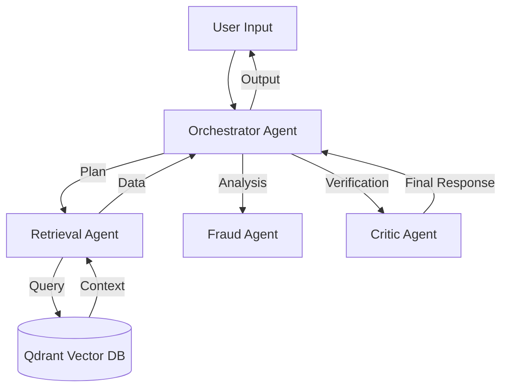

# 🛡️ Sahayak - The Vernacular Financial Sentinel

**A Multi-Agent System for Financial Inclusion and Fraud Protection**

Built for the **Convolve Hackathon** (Pan-IIT AI/ML Hackathon).

---

## 📖 Overview

**Sahayak** (Helper/Assistant) is an intelligent, vernacular-first financial assistant designed to bridge the digital divide for rural and semi-urban users. It acts as a protective layer against financial fraud while simplifying complex banking tasks through natural language interaction.

By leveraging a powerful **Multi-Agent Architecture** and **Vector Retrieval (RAG)**, Sahayak provides:
- **Real-time Fraud Detection**: Analyzes transaction patterns and communication for potential scams.
- **Vernacular Support**: Speaks your language (Hindi/English) for seamless interaction.
- **Financial Literacy**: Explains complex schemes (like PMJDY) in simple terms.

---

## ✨ Features

- **🗣️ Vernacular Voice Interface**: Interact using natural speech in Hindi or English.
- **🤖 Multi-Agent Orchestration**: Specialized agents for Planning, Retrieval, Fraud Detection, and Critique.
- **📚 Knowledge Retrieval (RAG)**: Accurate answers sourced from official documents (RBI guidelines, Government schemes).
- **🛡️ Fraud Sentinel**: Proactive identification of suspicious activities.
- **⚡ High Performance**: Powered by Groq (Llama 3) for ultra-fast inference and Qdrant for efficient vector search.
- **📊 Interactive Dashboard**: User-friendly interface built with Streamlit.

---

## 🚀 Quick Start

### 1. Prerequisites

Before you begin, ensure you have the following installed:
- **Python 3.11+**: [Download Here](https://www.python.org/downloads/)
- **Docker**: Required for running the Qdrant vector database. [Get Docker](https://www.docker.com/products/docker-desktop/)
- **Git**: Version control system.

### 2. Installation

1.  **Clone the Repository**
    ```bash
    git clone <repository-url>
    cd sahayak
    ```

2.  **Set up Virtual Environment**
    It's recommended to use a virtual environment to manage dependencies.
    ```bash
    python -m venv venv
    source venv/bin/activate  # On Windows: venv\\Scripts\\activate
    ```

3.  **Install Dependencies**
    ```bash
    # For Mac Users with Apple Silicon (M1/M2/M3), install PyTorch first:
    # pip install --pre torch torchvision torchaudio --index-url https://download.pytorch.org/whl/nightly/cpu

    pip install -r requirements.txt
    ```

4.  **Start Vector Database (Qdrant)**
    Run Qdrant locally using Docker:
    ```bash
    docker run -p 6333:6333 -p 6334:6334 \
        -v $(pwd)/qdrant_storage:/qdrant/storage \
        qdrant/qdrant
    ```

### 3. Configuration

1.  **Environment Variables**
    Copy the example environment file and configure your API keys.
    ```bash
    cp .env.example .env
    ```

2.  **Edit `.env`**
    Open `.env` in your text editor and fill in the required API keys.

    | Service | Variable | Requirement | Description |
    | :--- | :--- | :--- | :--- |
    | **Groq** | `GROQ_API_KEY` | **Required** | Primary LLM provider for fast inference. |
    | **Perplexity** | `PERPLEXITY_API_KEY` | **Required** | Online LLM for real-time information. |
    | **Gemini** | `GEMINI_API_KEY` | **Required** | Multimodal backup model. |
    | **Deepgram** | `DEEPGRAM_API_KEY` | Optional | For real-time high-quality speech-to-text. |
    | **Cohere** | `COHERE_API_KEY` | Optional | For production-grade embeddings. |

    > 💡 **Note**: If optional keys are missing, the system falls back to local models (Whisper for STT, SentenceTransformers for embeddings).

---

## 🎮 Usage

### Running the Dashboard

Launch the main application interface:
```bash
streamlit run dashboard/app.py
```
This will open the dashboard in your default web browser (usually at `http://localhost:8501`).

### Utility Scripts

The project includes several helper scripts in the `scripts/` directory:

-   **Test API Connections**: verify your setup.
    ```bash
    python scripts/test_adapters.py
    ```
-   **Initialize Database**: Setup Qdrant collections.
    ```bash
    python scripts/setup_qdrant.py
    ```
-   **Load Demo Data**: Ingest sample documents (PMJDY details, RBI guidelines) into the knowledge base.
    ```bash
    python scripts/load_demo_data.py
    ```

---

## 🏗️ Architecture

Sahayak uses a sophisticated **Agentic Workflow**:



1.  **Orchestrator**: The central brain that plans the task and delegates sub-tasks.
2.  **Retrieval Agent**: Searches the Vector Database for relevant context (financial rules, schemes).
3.  **Fraud Agent**: specifically analyzes the input for known fraud patterns.
4.  **Critic Agent**: Reviews the generated response for accuracy and safety before showing it to the user.

---

## 📁 Project Structure

```text
sahayak/
├── sahayak/                 # Core Package
│   ├── adapters/            # Integrations (LLM, Embeddings, Speech, Vision)
│   ├── agents/              # Sentinel Agents (Orchestrator, Fraud, etc.)
│   ├── config/              # Configuration management
│   ├── memory/              # Memory management (Qdrant interfaces)
│   └── utils/               # Helper functions
├── dashboard/               # Streamlit User Interface
├── data/                    # Storage for demo documents
├── scripts/                 # Setup and utility scripts
├── .env.example             # Template for environment variables
└── requirements.txt         # Python dependencies
```

---

## 🔧 Troubleshooting

-   **"Collection 'semantic_cache' doesn't exist"**: Run `python scripts/setup_qdrant.py` to initialize the collections.
-   **Detailed Logs**: Check the terminal output for INFO/DEBUG logs to trace agent activities.
-   **"zsh: command not found: docker"**: You do not have Docker installed. Download "Docker Desktop" from [docker.com](https://www.docker.com/products/docker-desktop/) and start the application before running the command.
-   **Docker Connection Error**: Ensure Docker Desktop is running and port 6333 is not blocked.

---

## 📝 License

This project is licensed under the MIT License.
